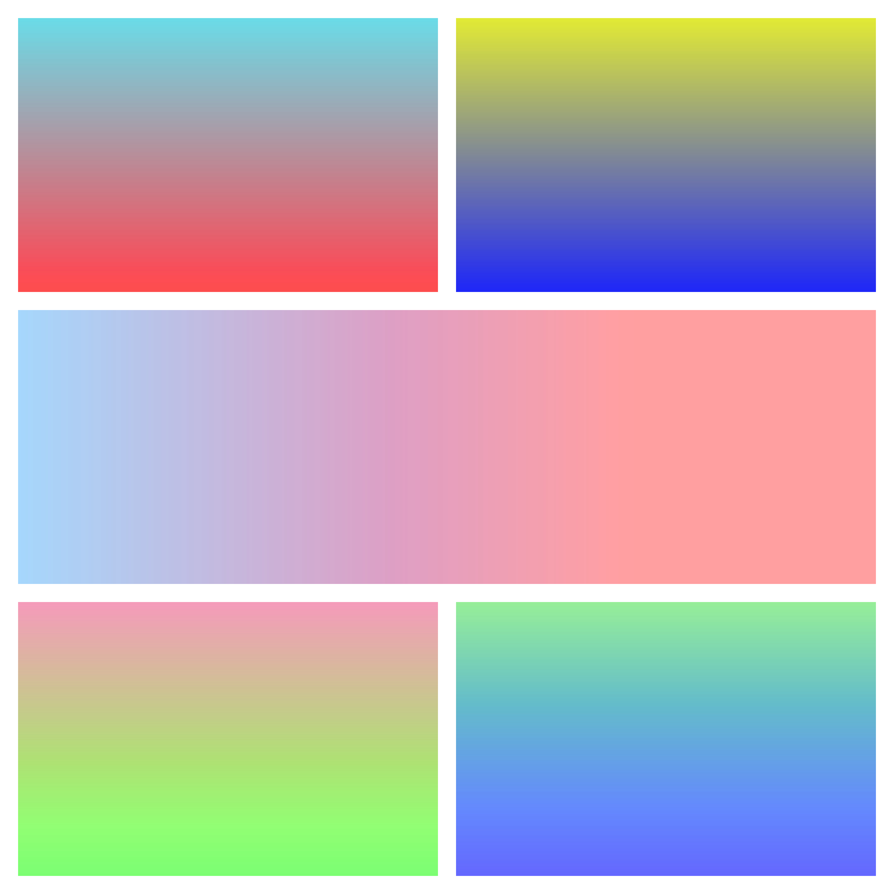
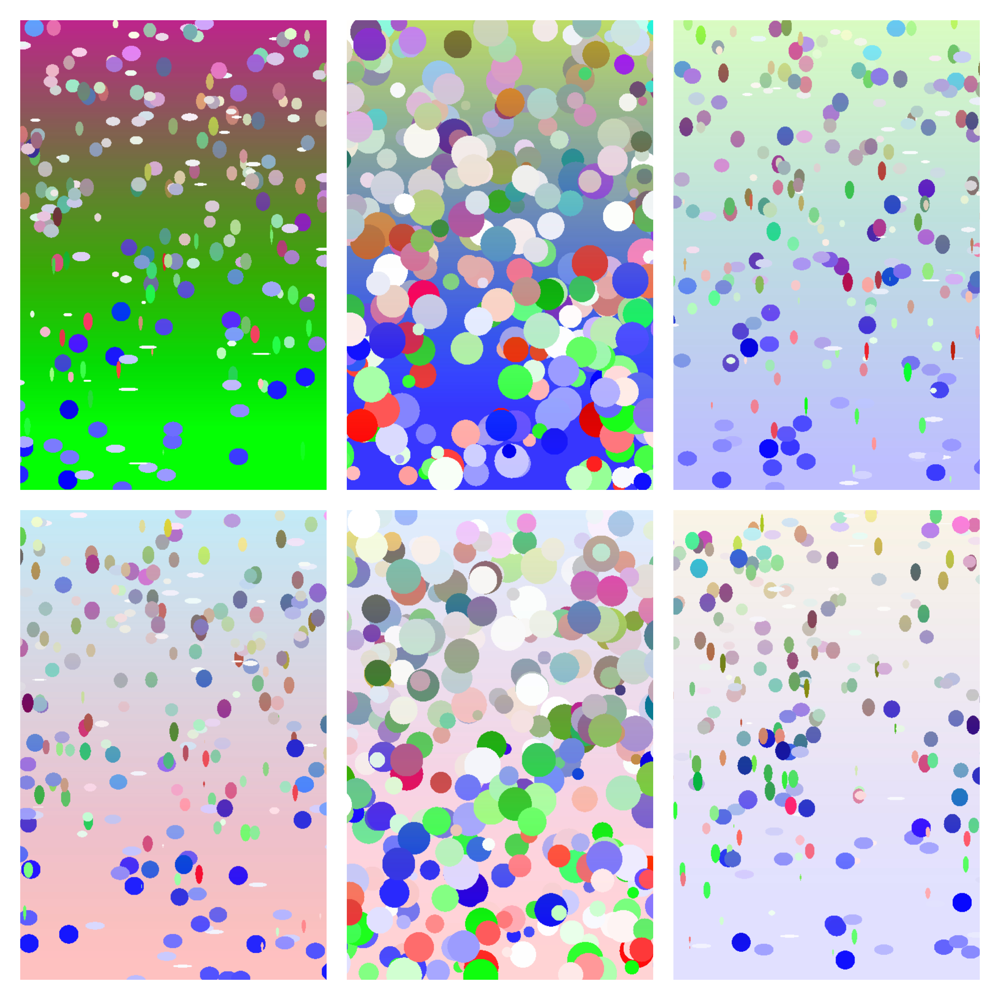

# Beautiful Random Images
Utilizing the concept of randomness, and adding a little bit of math, geometry, and patterns, I was able to come up with a JAVA code that can theoretically generate an infinite number of images containing:
 
 - Random mix of gradients
 - Randomly placed geometrical shapes
 - Some pretty cool rustic patterns!

Full Description: https://medium.com/geekculture/generating-infinite-beautiful-images-using-math-ed9dfbf5dc03

## Sample Results:

A. Gradient Color Patterns


B. Geometrical Shape Patterns


C. Rustic Patterns


## Configuration Steps (Super Simple)

```
import org.img.beautify.ImgBeautify;
public class Program {
    public static void main(String [] args) {
          String fileLocation = "/Location/myImg000.png";
          // pattern 1
          ImgBeautify.generateImage(fileLocation, ImgBeautify.Patterns.HORIZONTALGRADIENTPLAIN);
          // pattern 2
          ImgBeautify.generateImage(fileLocation, ImgBeautify.Patterns.HORIZONTALGRADIENTSHAPES);
          ...
          ...
          // pattern n
          ImgBeautify.generateImage(fileLocation, ImgBeautify.Patterns.VERTICALRUSTIC);
          }
}
```